# 도서관 도서 대여 관리 데이터베이스

백엔드 프레임워크 없이 MySQL에서 직접 **스키마 생성 → 샘플 데이터 입력 → 조회·수정·삭제 → 결과 확인**의 전체 과정을 연습하는 SQL 프로젝트입니다.  
회원, 도서, 저자, 카테고리, 대여 기록 사이의 관계를 데이터베이스 제약조건으로 표현하고, 실무에서 자주 사용하는 조회 요구를 SQL 한 문장으로 해결합니다.  

발표 준비는 [EXPLANATION.md](EXPLANATION.md), 
테이블 관계 그림은 [erd/README.md](erd/README.md), 
쿼리별 캡처 방법은 [results/README.md](results/README.md)를 참고

## 1. 과제 목적

- PK, FK, `NOT NULL`, `UNIQUE`, `CHECK`를 이용해 데이터 규칙을 스키마에 표현한다.
- 1:N과 N:M 관계를 테이블로 구현하고 연결된 데이터를 `JOIN`으로 조회한다.
- `WHERE`, `ORDER BY`, `LIMIT`, `GROUP BY`, 집계 함수와 서브쿼리를 연습한다.
- `INSERT`, `SELECT`, `UPDATE`, `DELETE`의 역할을 구분한다.
- 조회 패턴에 맞는 인덱스를 설계하고 `EXPLAIN`으로 실행 계획을 확인한다.
- 이후 ORM을 배울 때 객체 관계가 실제 SQL과 FK로 어떻게 처리되는지 이해한다.

## 2. 기술 환경

| 구분 | 사용 기술 |
| --- | --- |
| DBMS | MySQL 8.4 |
| 컨테이너 | Docker Compose, Docker Desktop WSL2 backend |
| SQL 실행 UI | Adminer 6 (`http://localhost:8080`) |
| 자동 실행 | MySQL CLI를 사용하는 WSL 셸 스크립트 |
| 문자 집합 | `utf8mb4`, `utf8mb4_0900_ai_ci` |
| 사용하지 않는 것 | 백엔드 프레임워크, View, Procedure, Trigger |

SQL은 MySQL 8.4 기준입니다. `AUTO_INCREMENT`, `UNSIGNED`, `GROUP_CONCAT`, `DATEDIFF`, `DATE_FORMAT`, `LIMIT`, `EXPLAIN`처럼 MySQL과 관련된 문법은 SQL 파일에서 주석으로 따로 표시했습니다.

## 3. Docker Desktop과 WSL2 준비

이 저장소는 Docker Desktop 자체를 설치하지 않습니다. Windows에 아직 없다면 다음 순서로 준비합니다.

1. PowerShell에서 `wsl --version`으로 WSL 버전을 확인합니다. Docker 공식 문서는 WSL 2.1.5 이상을 최소 조건으로 안내합니다.
2. 필요하면 관리자 PowerShell에서 `wsl --install`과 `wsl --update`를 실행하고 Windows를 다시 시작합니다.
3. [Docker Desktop Windows 설치 문서](https://docs.docker.com/desktop/setup/install/windows-install/)에 따라 Docker Desktop을 설치합니다.
4. Docker Desktop의 **Settings → General → Use WSL 2 based engine**을 확인합니다.
5. Ubuntu를 사용한다면 **Settings → Resources → WSL Integration**에서 해당 배포판을 켭니다.
6. WSL 터미널에서 `docker version`과 `docker compose version`이 동작하는지 확인합니다.

자세한 WSL 연동 조건은 [Docker Desktop WSL2 공식 문서](https://docs.docker.com/desktop/features/wsl/)를 참고하세요. Docker Engine을 Ubuntu WSL에 별도로 중복 설치하면 Docker Desktop과 충돌할 수 있으므로 이 프로젝트에서는 사용하지 않습니다.

## 4. 빠른 실행

아래 명령은 **Ubuntu WSL 터미널** 기준입니다. Windows의 `C:\work\codyssey-sql-database`는 WSL에서 `/mnt/c/work/codyssey-sql-database`로 접근합니다.

```bash
cd /mnt/c/work/codyssey-sql-database
cp .env.example .env
docker compose up -d
docker compose ps
```

`.env.example`의 비밀번호는 로컬 학습용입니다. 외부에서 접근 가능한 환경이나 실제 서비스에서는 반드시 강한 비밀번호로 바꿔야 합니다.

전체 SQL을 순서대로 실행하고 검증하려면 다음 명령을 사용합니다.

```bash
chmod +x scripts/*.sh
./scripts/run-all.sh
./scripts/verify.sh
```

`run-all.sh`는 `schema.sql`이 기존 학습 테이블을 지우고 다시 만들기 때문에 현재 `library_learning` 데이터가 초기화됩니다. 개인 데이터를 같은 DB에 넣지 마세요.

### 파일별 수동 실행

자동 스크립트가 하는 작업을 직접 확인하려면 다음 순서로 실행합니다.

```bash
set -a
. ./.env
set +a

docker compose exec -T mysql mysql -uroot -p"$MYSQL_ROOT_PASSWORD" < schema/schema.sql
docker compose exec -T mysql mysql -uroot -p"$MYSQL_ROOT_PASSWORD" < data/seed.sql
docker compose exec -T mysql mysql -uroot -p"$MYSQL_ROOT_PASSWORD" < queries/queries.sql
docker compose exec -T mysql mysql -uroot -p"$MYSQL_ROOT_PASSWORD" < verification/verification.sql
```

실행 순서는 반드시 `schema → seed → queries → verification`입니다. 자식 테이블은 부모 PK를 FK로 참조하므로 스키마와 부모 데이터가 먼저 존재해야 합니다. Query 18의 인덱스도 `queries.sql` 실행 중 만들어지므로, 같은 파일만 두 번 실행하면 중복 인덱스 오류가 납니다. 다시 연습할 때는 `schema.sql`부터 실행합니다.

## 5. Adminer 접속과 결과 캡처

1. 브라우저에서 `http://localhost:8080`을 엽니다.
2. 시스템은 `MySQL`, 서버는 `mysql`을 선택합니다.
3. 사용자 이름은 `.env`의 `MYSQL_USER`, 비밀번호는 `MYSQL_PASSWORD` 값을 입력합니다.
4. 데이터베이스는 `library_learning`을 입력합니다.
5. 왼쪽의 **SQL 명령**에서 `queries/queries.sql`의 쿼리를 번호별로 실행합니다.
6. 결과 화면을 [results/README.md](results/README.md)의 이름으로 저장합니다.

Adminer는 Docker 내부에서 실행되므로 별도 프로그램 설치가 필요 없습니다. DBeaver를 나중에 사용하더라도 같은 SQL 파일을 그대로 실행할 수 있으며, 접속 주소는 `localhost:3306`입니다.

## 6. 데이터 모델

| 테이블 | 역할 | PK | 주요 제약조건 |
| --- | --- | --- | --- |
| `members` | 회원 기본 정보 | `member_id` | 이메일 `UNIQUE`, 상태 `CHECK` |
| `categories` | 도서 분류 | `category_id` | 분류명 `UNIQUE` |
| `authors` | 저자 정보 | `author_id` | 저자명 `NOT NULL` |
| `books` | 도서와 보유 권수 | `book_id` | ISBN `UNIQUE`, `category_id` FK, 권수 `CHECK` |
| `book_authors` | 도서-저자 연결 | `(book_id, author_id)` | 두 FK, 저자 순서 `UNIQUE` |
| `loans` | 대여·반납 이력 | `loan_id` | 회원/도서 FK, 날짜 `CHECK` |

### 테이블을 분리한 이유

회원 이름이나 카테고리명을 대여 행마다 반복 저장하면 이름을 바꿀 때 여러 행을 수정해야 하고, 일부만 바뀌면 서로 다른 값이 남습니다.  
이를 **갱신 이상**이라고 합니다. 회원·카테고리·저자처럼 독립적인 대상을 한 곳에 저장하고,  
다른 테이블에서는 PK를 FK로 참조하면 중복을 줄이고 하나의 기준값을 유지할 수 있습니다. 

`book_authors`를 둔 이유는 한 도서에 여러 저자가 참여할 수 있고 한 저자도 여러 도서를 쓸 수 있기 때문입니다.   
관계형 DB에서 이 N:M 관계를 직접 FK 하나로 표현할 수 없으므로 두 개의 1:N 관계로 바꾸는 연결 테이블이 필요합니다.  

### 테이블 관계

- `categories 1:N books`: 한 카테고리에 여러 도서가 속하고, 한 도서는 한 카테고리를 가진다.
- `members 1:N loans`: 한 회원은 여러 번 대여할 수 있고, 한 대여는 한 회원에게 속한다.
- `books 1:N loans`: 한 도서는 시간에 따라 여러 번 대여될 수 있고, 한 대여는 한 도서를 가리킨다.
- `books 1:N book_authors`, `authors 1:N book_authors`: 두 관계를 합쳐 도서와 저자의 N:M을 표현한다.

대여 이력이 있는 회원이나 도서는 `ON DELETE RESTRICT`로 삭제를 막아 기록을 보호합니다.  
반면 `book_authors`는 그 자체가 독립 기록이 아니라 연결 정보이므로 도서나 저자가 삭제되면 연결 행도 함께 정리되도록 `ON DELETE CASCADE`를 사용합니다.

## 7. PK와 FK 설명

### PK(Primary Key)

PK는 테이블의 각 행을 중복 없이 식별하는 열 또는 열의 조합입니다. `member_name`은 동명이인이 있을 수 있고 이메일은 바뀔 수 있으므로 안정적인 식별자로 적합하지 않습니다.  
따라서 시스템이 생성하는 `member_id`를 PK로 사용합니다. PK는 `NULL`일 수 없고 중복될 수 없습니다.

`book_authors`는 연결 자체를 식별하면 되므로 별도의 번호 대신 `(book_id, author_id)`를 복합 PK로 사용합니다. 이 구조는 같은 저자가 같은 책에 두 번 연결되는 것도 막습니다.

### FK(Foreign Key)

FK는 다른 테이블의 PK 또는 UNIQUE 키를 참조하는 제약조건입니다.   
`loans.member_id`가 `members.member_id`를 참조하므로 존재하지 않는 회원의 대여를 입력할 수 없습니다.   
FK는 테이블 사이를 JOIN하는 열이기도 하지만, 핵심 역할은 잘못된 참조를 DB가 거부하게 하는 **참조 무결성** 보장입니다.

### 1:N 관계

1:N은 부모의 한 행에 자식의 여러 행이 연결되는 관계입니다.  
회원 한 명이 여러 대여 기록을 가질 수 있으므로 회원이 1, 대여가 N입니다. 구현할 때 N 쪽인 `loans`에 `member_id` FK를 둡니다.

## 8. 주요 SQL 학습 내용

### JOIN은 왜 사용하는가

정규화된 데이터는 여러 테이블에 나뉘어 있으므로 한 화면에 회원명과 도서명을 함께 표시하려면 연결이 필요합니다.  
Query 05는 대여 기록인 `loans`를 기준으로 회원과 도서를 PK/FK 조건으로 연결합니다.

- `INNER JOIN`: 양쪽에 일치하는 행이 있을 때만 반환합니다.  
- 실제 대여 상세처럼 관계가 반드시 존재해야 하는 조회에 적합합니다.  
- `LEFT JOIN`: 왼쪽 기준 테이블의 모든 행을 유지합니다.  
- 대여 이력이 없는 회원도 찾아야 하는 Query 08에서는 `members`를 왼쪽에 놓고,  
- 연결되지 않은 `loans`가 `NULL`인 행을 찾습니다.  

### GROUP BY는 왜 사용하는가

`GROUP BY`는 여러 행을 지정한 기준별 그룹으로 묶어 각 그룹에 `COUNT`, `SUM`, `AVG` 같은 집계 함수를 적용합니다.   
Query 09는 `category_id` 단위, Query 10은 `book_id` 단위, Query 15는 대여 월 단위로 데이터를 묶습니다.   
집계하지 않은 열을 무분별하게 SELECT하면 어느 행의 값을 표시해야 하는지 모호해지므로 그룹 기준 열만 함께 조회합니다.

### 서브쿼리는 왜 사용하는가

서브쿼리는 다른 SQL의 결과를 조건이나 임시 데이터 집합으로 사용합니다.   
Query 12는 회원별 대여 횟수를 먼저 구해야 전체 평균을 계산할 수 있어 단계적인 서브쿼리가 자연스럽습니다.   
Query 13과 14는 같은 요구를 JOIN과 `EXISTS`로 각각 풀어 결과는 같지만 사고 방식이 다름을 보여 줍니다.  

### 인덱스는 왜 사용하는가

인덱스는 테이블 전체를 매번 읽지 않고 조건에 맞는 행의 위치를 빠르게 찾도록 돕는 별도 자료구조입니다.   
현재 미반납 도서를 찾을 때 `book_id = ? AND returned_on IS NULL`을 함께 사용하므로 Query 18에서 `(book_id, returned_on)` 순서의 복합 인덱스를 만듭니다.   
선두 열인 `book_id` 없이 `returned_on`만 검색하면 이 인덱스의 효과가 제한될 수 있습니다.

인덱스는 조회 속도를 높일 수 있지만 INSERT/UPDATE/DELETE 때 함께 갱신해야 하고 저장 공간도 사용합니다.  
따라서 모든 열에 만드는 것이 아니라 실제 조회 조건, JOIN, 정렬 패턴을 근거로 선택합니다.   
샘플 데이터는 매우 작아 `EXPLAIN`에서 전체 스캔이 선택될 수 있는데, 이는 옵티마이저가 소량 데이터에는 전체 읽기가 더 싸다고 판단한 정상적인 결과입니다.

## 9. 데이터베이스와 엑셀의 차이

차이는 단순히 데이터 양이 아닙니다.   
엑셀도 작은 데이터 목록, 계산, 차트에는 매우 유용하고 시트 간 참조도 만들 수 있습니다.   
그러나 관계형 데이터베이스는 다음 기능을 데이터 저장 계층에서 일관되게 제공합니다.  

- PK/FK/UNIQUE/CHECK로 잘못된 값을 저장 단계에서 거부한다.
- 여러 테이블의 관계를 명시하고 JOIN으로 조합한다.
- 여러 사용자의 동시 작업을 트랜잭션과 잠금으로 관리한다.
- SQL이라는 선언적 언어로 대량 필터링, 집계, 정렬을 반복 실행한다.
- 권한, 백업, 복구, 인덱스, 실행 계획 같은 운영 기능을 제공한다.

따라서 엑셀은 개인 분석과 표현에 강하고, 관계형 DB는 서비스의 공동 데이터를 규칙에 따라 안전하고 일관되게 저장·조회하는 데 적합합니다.

## 10. 핵심 지표 3개

1. **카테고리별 등록 도서 수(Query 09)**: 장서 구성이 특정 분야에 치우쳤는지 확인한다.
2. **도서별 누적 대여 횟수(Query 10)**: 인기 도서와 추가 구매 후보를 찾는다.
3. **월별 대여 건수(Query 15)**: 이용량의 월별 변화와 운영 추이를 확인한다.

## 11. 설계 한계

`total_copies`보다 많은 미반납 대여가 동시에 생기는 규칙은 다른 행들의 개수를 확인해야 하므로   
단순 FK나 행 단위 CHECK로 완전히 강제할 수 없습니다.   
실제 서비스라면 트랜잭션 안에서 재고 행을 잠그거나 애플리케이션 로직, 별도 도서 복본 테이블 등을 사용합니다.   
이 과제는 Trigger와 백엔드 프레임워크를 금지하므로 샘플 데이터에서 정합성을 지키고 조회로 확인합니다.  

## 12. 종료와 데이터 초기화

컨테이너만 멈추고 데이터를 보존하려면 다음을 실행합니다.

```bash
docker compose stop
```

다음 명령은 컨테이너뿐 아니라 named volume의 MySQL 데이터까지 삭제합니다. 다시 복구하려면 SQL 파일을 재실행해야 합니다.

```bash
docker compose down --volumes
```


# 핵심 쿼리 15개 + 실행 결과 캡처(과제 제출 조건)
* 조회/조인/집계/서브쿼리/수정 및 삭제까지 포함한 쿼리 15개를 작성한다.
### Query 01 실행 결과
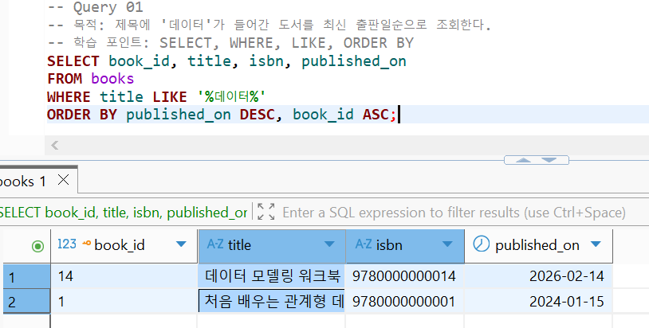

### Query 02 실행 결과
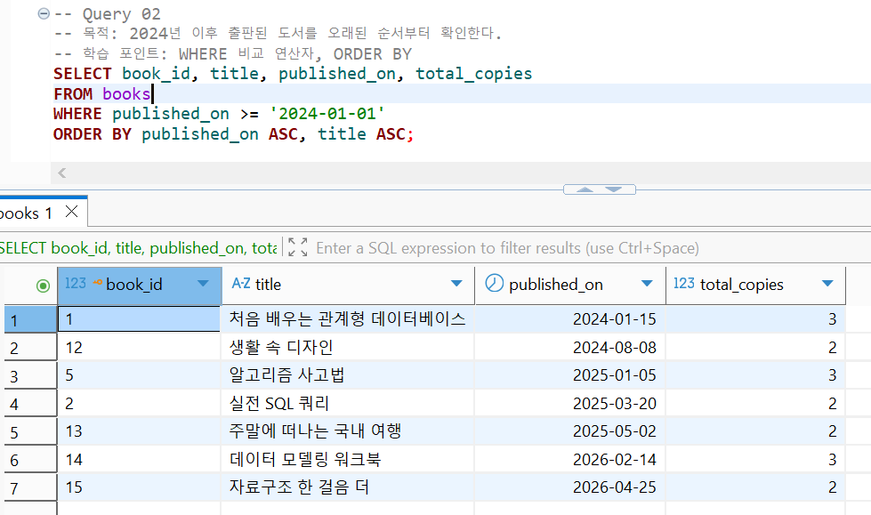

### Query 03 실행 결과
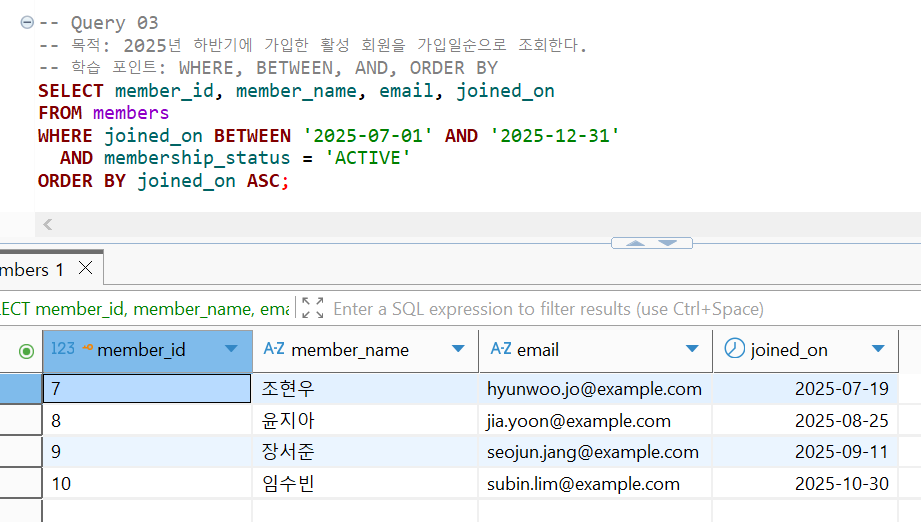

### Query 04 실행 결과
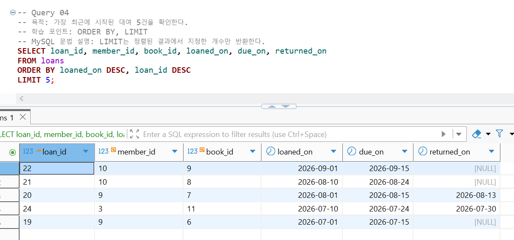

### Query 05 실행 결과
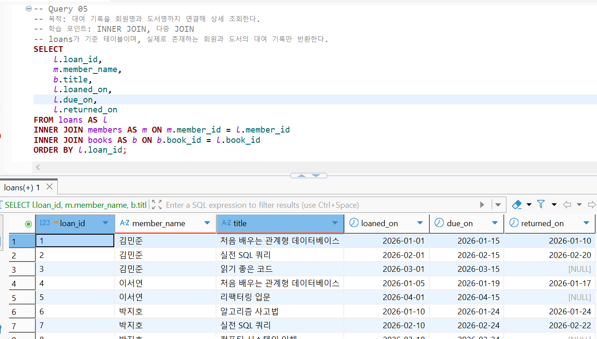

### Query 06 실행 결과
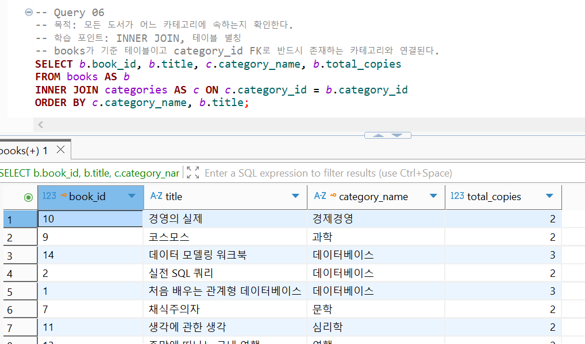

### Query 07 실행 결과
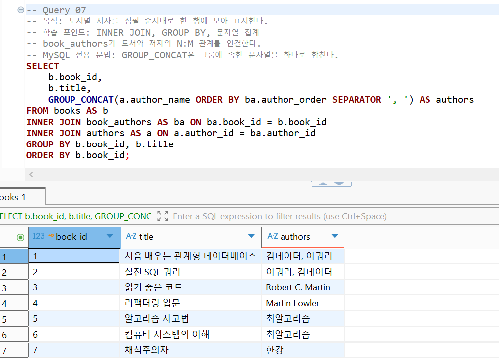

### Query 08 실행 결과
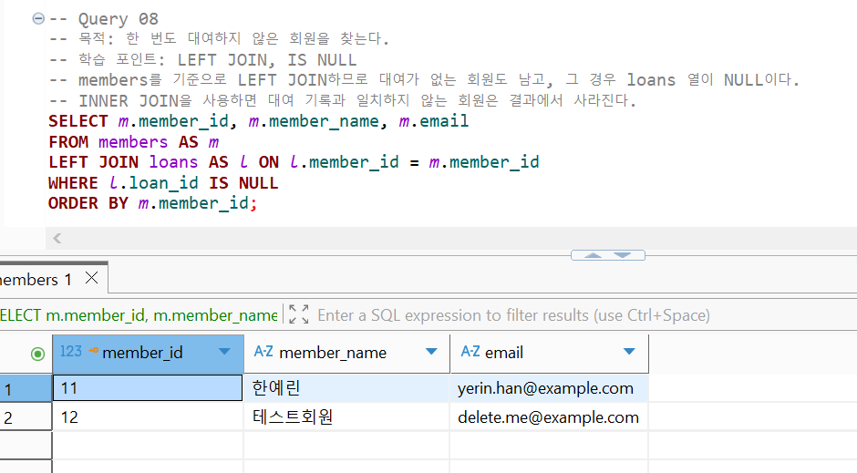

### Query 09 실행 결과
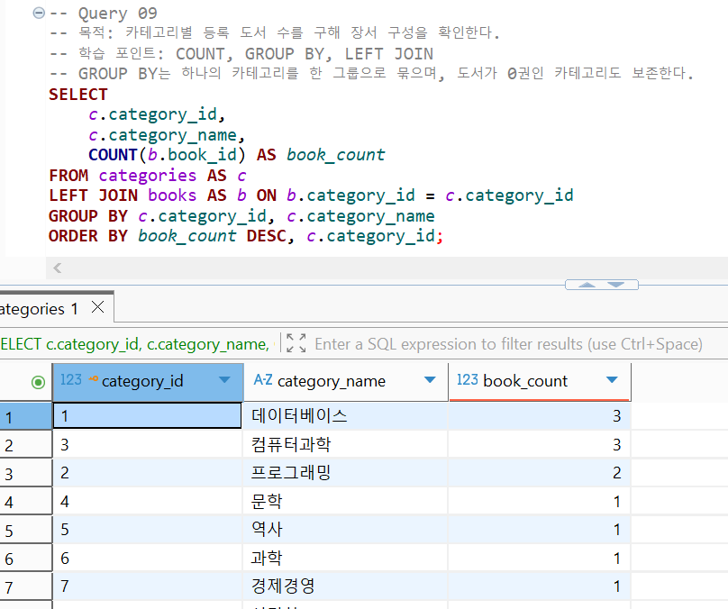

### Query 10 실행 결과
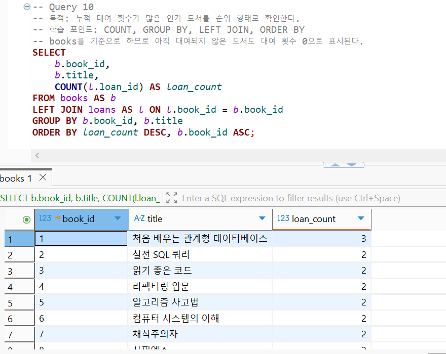

### Query 11 실행 결과
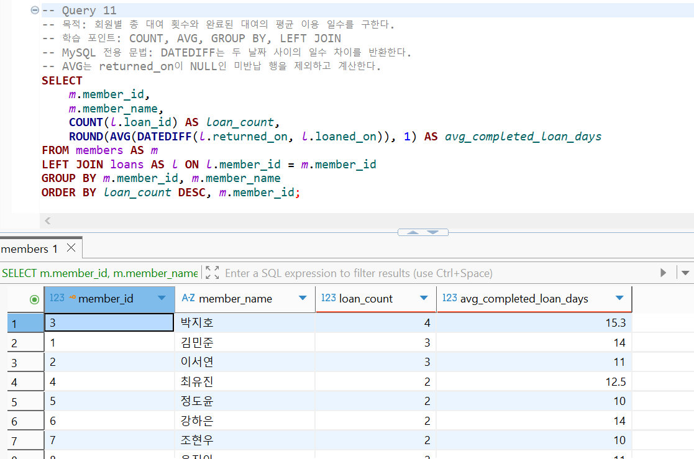

### Query 12 실행 결과
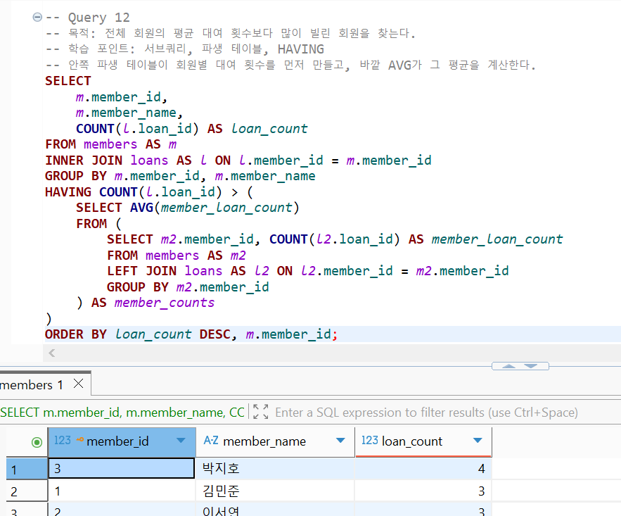

### Query 13 실행 결과
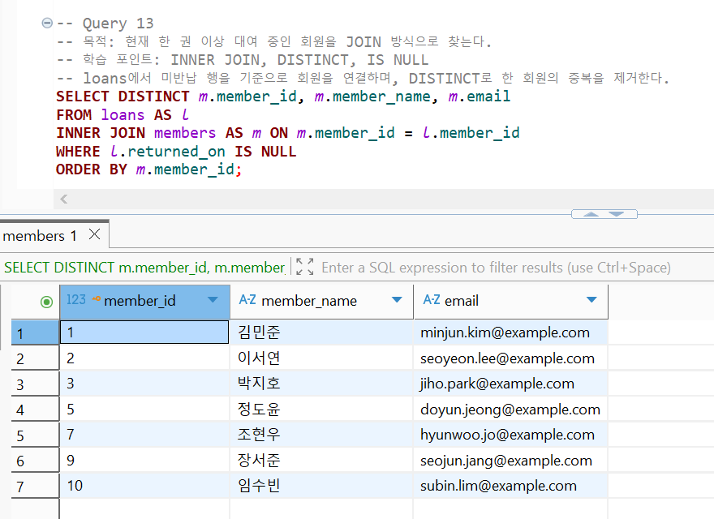

### Query 14 실행 결과
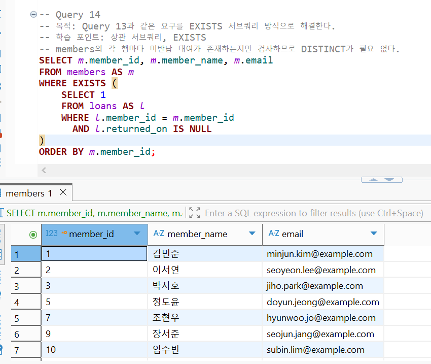

### Query 15 실행 결과
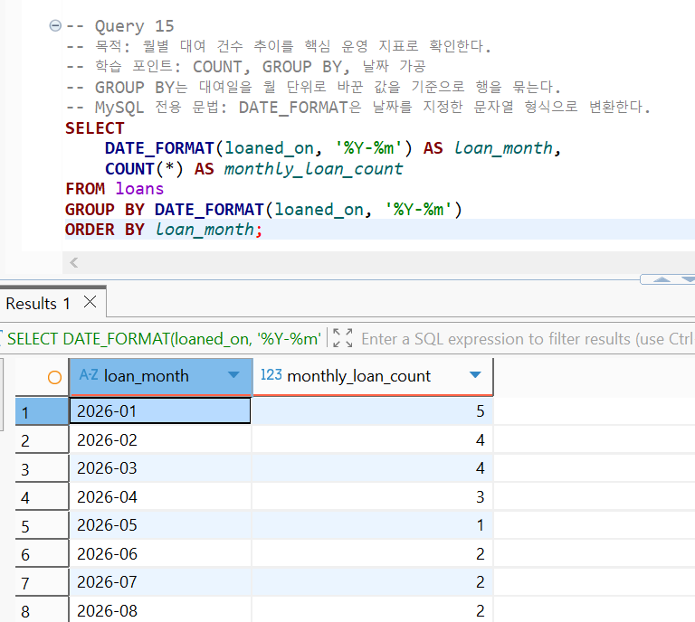

