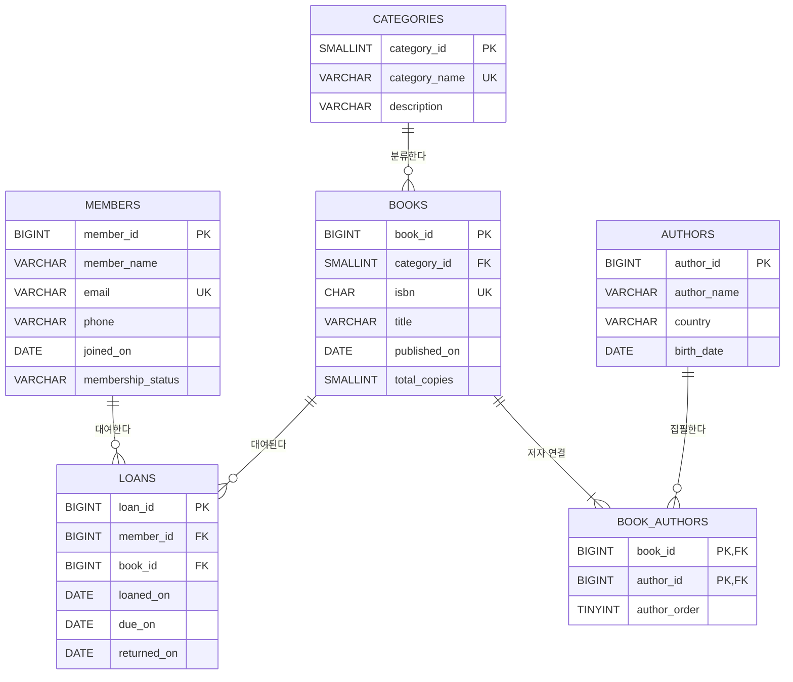

# 도서관 대여 관리 ERD

아래 ERD는 PK, FK와 테이블 사이의 카디널리티를 보여 줍니다. 별도 이미지가 필요한 제출 환경에서는 [library-erd.svg](library-erd.svg)를 사용하세요.

## 관계 설명

- `members ||--o{ loans`: 회원은 대여가 없거나 여러 건일 수 있지만 한 대여는 반드시 한 회원을 참조합니다.
- `books ||--o{ loans`: 도서는 아직 대여되지 않았거나 여러 번 대여될 수 있지만 한 대여는 반드시 한 도서를 참조합니다.
- `categories ||--o{ books`: 카테고리는 도서가 없을 수도 있고 여러 도서를 포함할 수 있습니다. 한 도서는 반드시 한 카테고리에 속합니다.
- `books ||--|{ book_authors`: 샘플의 모든 도서에는 저자 연결이 하나 이상 있습니다.
- `authors ||--o{ book_authors`: 한 저자는 여러 도서를 집필할 수 있습니다.

## 키 설계 설명

독립 엔터티인 회원, 카테고리, 저자, 도서, 대여에는 숫자 단일 PK를 사용합니다. 이름과 이메일 같은 업무 값은 바뀌거나 중복될 수 있기 때문입니다. `book_authors`는 도서와 저자의 연결 자체가 한 행의 정체성이므로 두 FK를 합친 복합 PK를 사용합니다.

`loans.member_id`와 `loans.book_id`가 각각 회원과 도서를 참조해 존재하지 않는 대여 대상 입력을 막습니다. `books.category_id`는 등록된 카테고리만 사용하게 합니다. `book_authors`의 두 FK는 공동 저자와 한 저자의 여러 도서를 모두 표현합니다.

